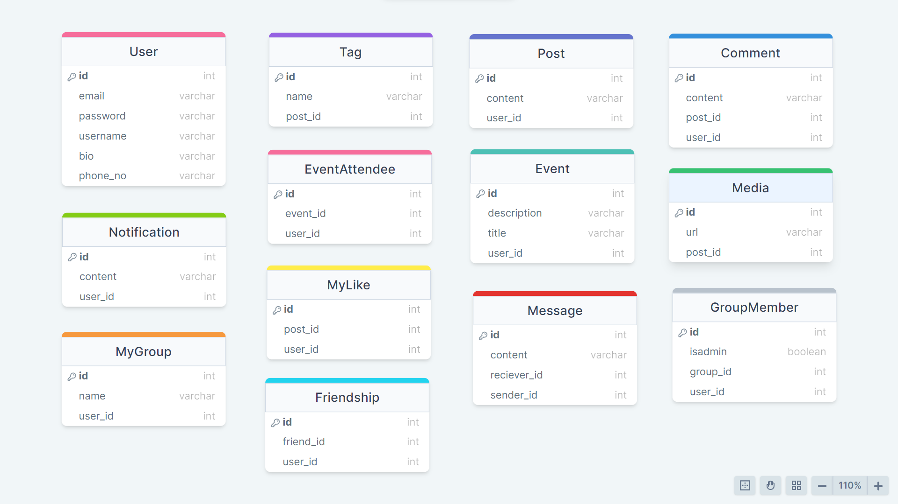

# Social_Media
 Built with robust and scalable Java Spring Boot framework, this backend project provides seamless connectivity, efficient data management, and secure user authentication for your social media app. With RESTful APIs, database integration, and optimized performance, this backend solution ensures smooth functionality, reliable data handling, and enhanced user experience. Get your social media app up and running with the power of Java Spring Boot backend!"

<h2>TechStack Used</h2>
<ul>
 <li>Java</li>
 <li>SQL</li>
 <li>Spring Boot</li>
 <li>Hibernate</li>
 <li>Maven</li>
</ul>

<h2>Tools Used</h2>
<ul>
 <li>STS</li>
 <li>Postman</li>
 <li>Swagger</li>
 <li>MySql CommandLine</li>
 <li>MySql WorkBench</li>
 <li>Tomcat Server</li>
</ul>

# Diagram

<!DOCTYPE html>
<html>
<head>
	<title>User Controller API Documentation</title>
</head>
<body>
	<header>
		<h1>User Controller API Documentation</h1>
	</header>
	<main>
		<section>
			<h2>API Endpoints</h2>
			<ul>
				<li>
					<h3>POST /user/signup</h3>
					
Endpoint to register a new user account.

					
Request body should contain User object.

				</li>
				<li>
					<h3>PUT /user/update/profile/{userId}</h3>
					
Endpoint to update user's account details.

					
Request body should contain User object and path variable should contain userId.

				</li>
				<li>
					<h3>GET /user/{userName}</h3>
					
Endpoint to search user by their username.

					
Path variable should contain username.

				</li>
				<li>
					<h3>GET /user/email/{email}</h3>
					
Endpoint to search user by their email.

					
Path variable should contain email.

				</li>
				<li>
					<h3>GET /user/interests/{interests}</h3>
					
Endpoint to search users by interests.

					
Path variable should contain interests.

				</li>
				<li>
					<h3>DELETE /user/delete/{userId}</h3>
					
Endpoint to delete user account by userId.

					
Path variable should contain userId.

				</li>
				<li>
					<h3>DELETE /user/deleteUser/{email}</h3>
					
Endpoint to delete user account by email.

					
Path variable should contain email.

				</li>
			</ul>
		</section>
	</main>
</body>
</html>
